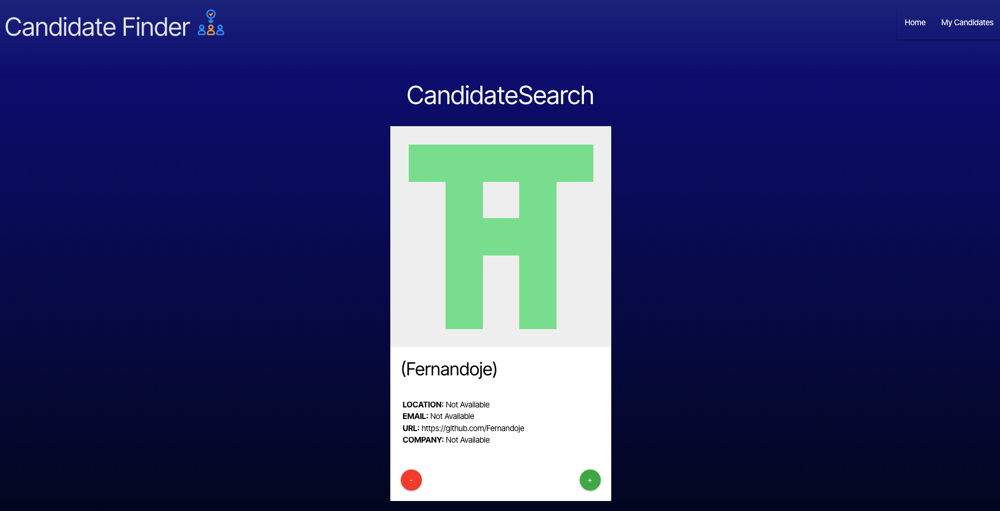
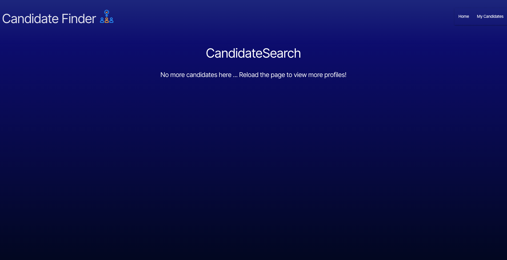
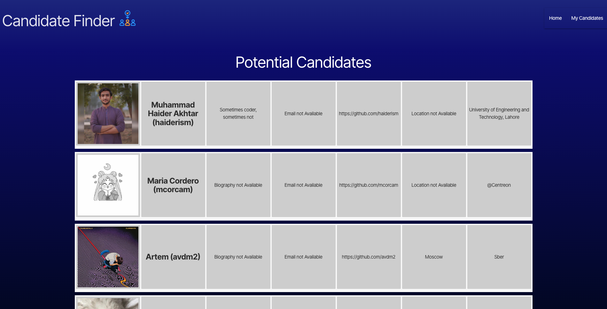
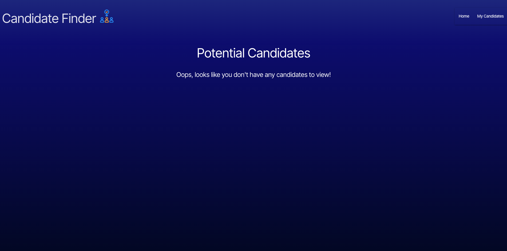

# Candidate Finder

## Description

This is a web application to help you find your next employee from GitHub!

## Table of Contents

- [Installation](#installation)
- [Usage](#usage)
- [Credits](#credits)
- [License](#license)
- [Contributing](#contributing)
- [Tests](#tests)
- [Questions](#questions)

## Installation

To use the application, click this [link](https://candidate-finder-ufpi.onrender.com/) to navigate to the webpage.

## Usage

Once you've successfully navigated to the webpage, you'll see this page.

The cards will change every time the page is refreshed. On the cards, clicking the red "-" button will switch the card to the next profile with no additional action. However, clicking the green "+" will save the profile to the "My Candidates" page and then switch the card to the next profile.

If an error loading candidates occurs on the home page or if you've exhausted the current selection of profiles, you will recieve this message informing you of the issue and prompting you to reload the webpage.

On the "My Candidates" page, you'll see this screen if you have saved some profiles.

Lastly, if you have not saved any candidates, you will see this screen, which informs you that there are no candidates to view.

There is currently no way to cleanly delete candidates from the "My Candidates" page, so to do this for now, right click anywhere on the "My Candidates" page, select "Inspect", select "Application" in the Dev Tool navbar (It might be hidden by the right pointing arrows; just click those arrows to uncover it), and then click on the circle with a line though it next to the "filter" text entry. This should clear the browser's local storage, and after refreshing the page, the saved candidates should be gone!

Also, when refreshing the page from the "My Candidates" page, the bowser will display an error. Just navgate back to the home page and refresh it again and the application should load properly. It's a bug that I noticed but haven't had the time to troubleshoot yet.

That's it for Candidate Finder. Happy searching!

## Credits

- The website tab / title icon was [created by Erix](https://www.flaticon.com/free-icons/recruitment).

## License

Licensed under the [MIT](./LICENSE) license.

## Contributing

To contribute, clone the repository onto your local machine, edit and push to a feature branch. Open a pull request so your changes can be reviewed. If they improve the app, we will merge your changes to the main branch code.

## Tests

There are currently no tests developed for this project.

## Questions

- GitHub: [Johngoldade](https://github.com/Johngoldade)
- Email: [goldade.john@gmail.com](mailto:goldade.john@gmail.com)

To ask further questions, reach out to me at the above email and I will get back to you as soon as I can.